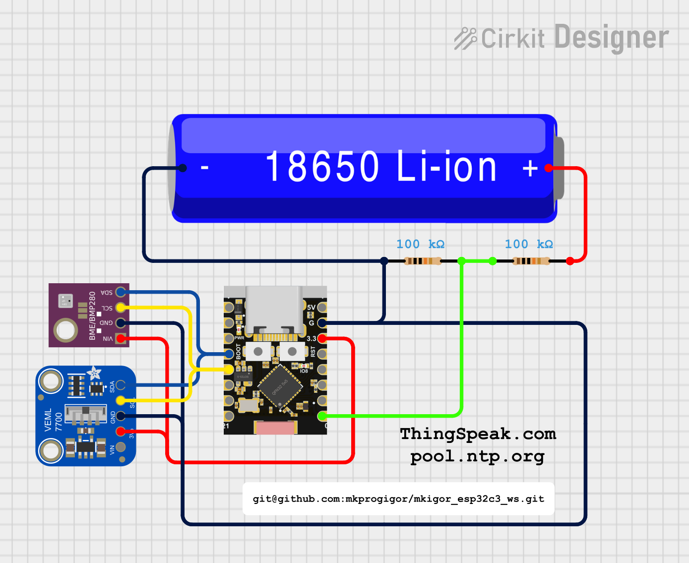

# Easy DIY weather station 

A small project of DIY weather station: 
Hardware: esp32-C3 Super Mini + Expansion board + bat. 18650, BME680, VEML7700 
Sofware: C++ Arduino framework on PlatformIO on Visual Studio Code. 
Visualisation build in IoT: https://thingspeak.mathworks.com/channels/2994389 
 
Result: Half year testing: BMP180, BME280 are good to measure temperature and pressure, parameters are according datasheet. BME280 (maybe my item) cannot measure outside humidity normally. BME680 do it well, and more, it has gas sensor. So, more expensive, BME680 won in this project :-) . 
Expansive board: it can charge battery (I=150 mA) and power esp32-C3 Super Mini from battery as long as voltage down  to 3.55 V (usually 1-2 weeks in sleep mode for std 18650 li-ion 2000 mA). "Sandwich" consume energy from USB-C 5 V about 50-85 mA in work mode, in light sleep mode 7 mA, deep sleep - 5,5 mA. But there is big fault: boart turn voltage of battery to USB-C connector. It made a lot of problems for me . 

 

  
